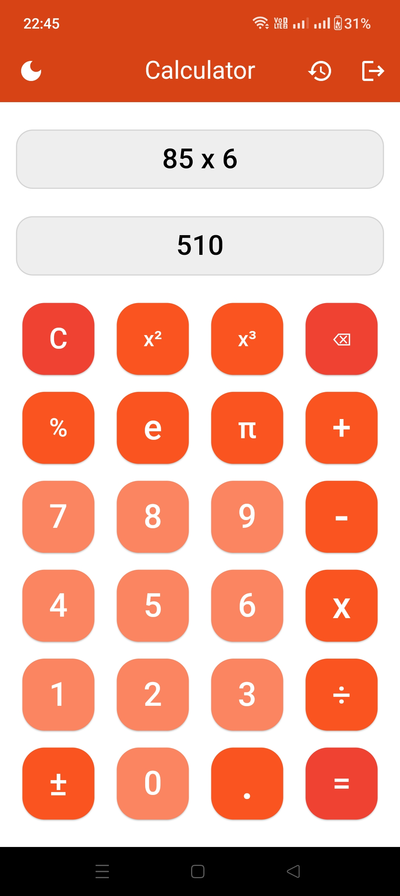
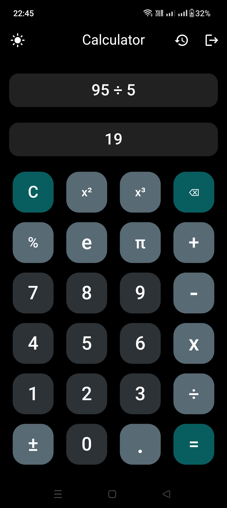
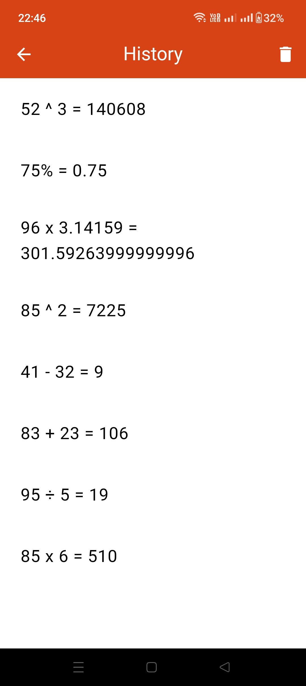
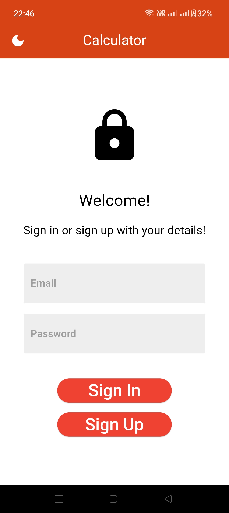

# Calculator

A Calculator app built for Android using Flutter and Dart. The application has support
for all simple mathematical operations and also features a dual theme with visually
appealing light and dark themes. The app uses Firebase Authentication to authenticate user sign in and sign up requests and Cloud Firestore to store the user's calculation history. The user can switch themes, view and delete their calculation history, and log out of their account using the navigation bar at the top of the user interface.

## Screenshots

### Light Theme

### Dark Theme

### User History

### Authentication
